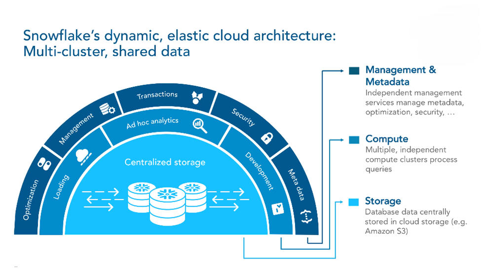

# Associate Snowflake Data Engineer: From Architecture to Data Modeling

## Project Overview

- 🧊 Snowflake Introduction  
- 🏗️ From Architecture to Running Databases  
- 🧮 Snowflake SQL  
- 🔄 Data Ingestion  
- ✍️ Data Manipulation  
- 🗄️ Database Project  
- 🧠 Data Modeling on Snowflake

---

## About

This project demonstrates core concepts and practices from the Snowflake Associate Data Engineer certification path.  
It covers the end-to-end process from understanding Snowflake architecture to building and managing databases, ingesting and transforming data, and applying data modeling techniques.

---

## Technologies

- **Snowflake**  
- **SQL (Snowflake dialect)**  
- **Jupyter Notebook / Python**